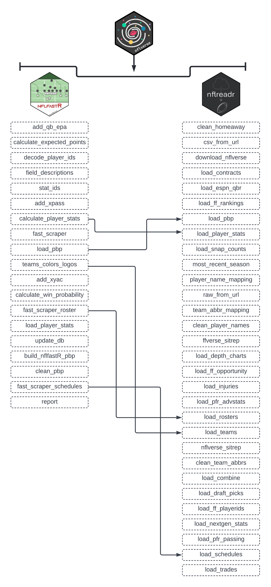

# An Introduction to NFL Analytics and the R Programming Language (\*rough draft)


As mentioned in the Preface of this book, the `nflverse` has drastically expanded since the inception of `nflfastR` in April of 2020. In total, the current version of the `nflverse` is comprised of five separate R packages:

1.  `nflfastR`
2.  `nflseedR`
3.  `nfl4th`
4.  `nflreadr`
5.  `nflplotR`

Installing the `nflverse` as a package in R will automatically install all five packages. However, the core focus of this book will be on `nflreadr`. It is understadable if you are confused by that, since the Preface of this book introduced the `nflfastR` package.

Because of that, it is important to note that the `nflreadr` package, as explained by its author ([Tan Ho](https://tanho.ca/)), is a "minimal package for downloading data from `nflverse` repositories. The data that *is* the `nflverse` is stored acoss five different GitHub repositories. Using `nflreadr` allows for easy access to any of these data sources. For lack of a better term, `nflreadr` acts as a shortcut of sorts while also operating with less dependencies.

As you will see in this book, using `nflreadr::` while coding provides nearly the identical functions included when using `nflfastR::`. In fact, running `nflfastR::load_pbp()` now calls, "under the hood," `nflreadr::load_pbp()` while `nflfastR::load_player_stats()` is now deprecated as well, and calls `nflreadr::load_player_stats()`.

Aside from that, the `nflreadr` package includes a number of data options not included in `nflfastR` such as combine, draft picks, contract, trades, injury information, and access to statistics on Pro Football Reference.

While `nflfastR` did initially serve as the foundation of the "amateur NFL analytics" movement, the `nflreadr` package has superceded it and now serves as the "catchall" package for all the various bits and pieces of the `nflverse`. Because of this, and to maintain consistency throughout, this book - nearly exclusively - will use `nflreadr::` when calling functions housed within the `nflverse` rather than `nflfastR::`.

To below diagram visualizes the relationship between `nflfastR` and `nflreadr`.

<div class="figure">

<p class="caption">(\#fig:nflverse-comparison)Comparing nflfastR to nflreadr</p>
</div>

## `nflreadr`: An Introduction to the Data

The most important part of the `nflverse` is, of course, the data. To begin, we will examine the core data that underpins the `nflverse`: player weekly stats and the more advanced and robust play-by--play data. Using `nflreadr`, the end user is able to collect weekly top-level stats via the `load_player_stats()` function or the much more robust play-by-play numbers by using the `load_pbp()` function.

As you may imagine, there is a **very important distinction between the `load_player_stats()`** **and `load_pbp()`**. As mentioned, `load_player_stats()` will provide you with weekly, pre-calculated statistics for either offense or kicking. Conversely, `load_pbp()` will provide over 350 metrics for every single play of every single game dating back to 1999.

The `load_player_stats()` function includes the following offensive information:


```r
offensive.stats <- nflreadr::load_player_stats(2021)
ls(offensive.stats)
```

```
##  [1] "air_yards_share"             "attempts"                   
##  [3] "carries"                     "completions"                
##  [5] "dakota"                      "fantasy_points"             
##  [7] "fantasy_points_ppr"          "interceptions"              
##  [9] "pacr"                        "passing_2pt_conversions"    
## [11] "passing_air_yards"           "passing_epa"                
## [13] "passing_first_downs"         "passing_tds"                
## [15] "passing_yards"               "passing_yards_after_catch"  
## [17] "player_id"                   "player_name"                
## [19] "racr"                        "receiving_2pt_conversions"  
## [21] "receiving_air_yards"         "receiving_epa"              
## [23] "receiving_first_downs"       "receiving_fumbles"          
## [25] "receiving_fumbles_lost"      "receiving_tds"              
## [27] "receiving_yards"             "receiving_yards_after_catch"
## [29] "recent_team"                 "receptions"                 
## [31] "rushing_2pt_conversions"     "rushing_epa"                
## [33] "rushing_first_downs"         "rushing_fumbles"            
## [35] "rushing_fumbles_lost"        "rushing_tds"                
## [37] "rushing_yards"               "sack_fumbles"               
## [39] "sack_fumbles_lost"           "sack_yards"                 
## [41] "sacks"                       "season"                     
## [43] "season_type"                 "special_teams_tds"          
## [45] "target_share"                "targets"                    
## [47] "week"                        "wopr"
```

As well, switching the `stat_type` to "kicking" provides the following information:


```r
kicking.stats <- nflreadr::load_player_stats(2021, stat_type = "kicking")
ls(kicking.stats)
```

```
##  [1] "fg_att"              "fg_blocked"          "fg_blocked_distance"
##  [4] "fg_blocked_list"     "fg_long"             "fg_made"            
##  [7] "fg_made_0_19"        "fg_made_20_29"       "fg_made_30_39"      
## [10] "fg_made_40_49"       "fg_made_50_59"       "fg_made_60_"        
## [13] "fg_made_distance"    "fg_made_list"        "fg_missed"          
## [16] "fg_missed_0_19"      "fg_missed_20_29"     "fg_missed_30_39"    
## [19] "fg_missed_40_49"     "fg_missed_50_59"     "fg_missed_60_"      
## [22] "fg_missed_distance"  "fg_missed_list"      "fg_pct"             
## [25] "gwfg_att"            "gwfg_blocked"        "gwfg_distance"      
## [28] "gwfg_made"           "gwfg_missed"         "pat_att"            
## [31] "pat_blocked"         "pat_made"            "pat_missed"         
## [34] "pat_pct"             "player_id"           "player_name"        
## [37] "season"              "season_type"         "team"               
## [40] "week"
```

While the data returned is not as robust as the play-by-play data we will covering next, the `load_player_stats()` function is extremely helpul when you need to quickly (and correctly!) recreate the official stats listed on either the NFL's website or on [Pro Football Reference](https://www.pro-football-reference.com/).

As an example, let's say you need to get Ben Roethlisberger's total passing yard and attempts from the 2021 season. You could do so via `load_pbp()` but, if you do not need further context, using `load_player_stats()` is much more efficient.

### Getting Weekly Player Stats via `load_player_stats()`

If you are familar with R, it might seem logical to do the following to get Roethlisberger's total passing yards and number of attempts from the 2021 season:


```r
weekly.data <- nflreadr::load_player_stats(2021)

ben.weekly <- weekly.data %>%
  group_by(player_id, player_name) %>%
  filter(season_type == "REG" & player_name == "B.Roethlisberger") %>%
  summarize(total.yards = sum(passing_yards),
            n.attempts = sum(attempts))
```

```
## `summarise()` has grouped output by 'player_id'. You can override using the
## `.groups` argument.
```

```r
tibble(ben.weekly)
```

```
## # A tibble: 1 x 4
##   player_id  player_name      total.yards n.attempts
##   <chr>      <chr>                  <dbl>      <int>
## 1 00-0022924 B.Roethlisberger        3740        605
```

As you can see in the `ben.weekly` output, we have matched his official 2021 regular stats perfectly with 3,740 passing yards on 605 attempts. The code we just created is doing several things. First, we are using `nflreadr::load_player_stats(2021)` to place the data into our R environment in a DF titled `weekly.data`.

Next, we group the data together by alike `player_id` (as every individual player has a unique ID number) as well as the player's actual name. At the filtering level, we are looking for just the regular season (`REG`) within `season_type` and also removing all quarterbacks except for Ben Roethlisberger. It is important to note that player names are just first initial and last name, without a space after the period.

After filtering for the regular season, we are able to summarize all of the weekly data into combined statistics by summing the weekly totals of passing yards and attempts.

Unfortunately, we are still not done. In order to get Roethlisberger's name attached to it, if you needed it, we needed to complete a `left_join` between our `ben.weekly` and `rosters` dataframes. To do so, we are matching up the `player_id` to the `gsis_id` within the roster information. After that information is combined, we are able to pull out just Roethlisberger's information and select the columns we want.

**However, filtering by `player_name` can lead to signifcant issues with your results.** An excellent example of this is Josh Allen. Let's recreate the code above that successfully provided Roethlisberger's stats, but replace Ben with Josh Allen:


```r
josh.allen <- weekly.data %>%
  group_by(player_name) %>%
  filter(player_name == "J.Allen" & season_type == "REG") %>%
  summarize(total.yards = sum(passing_yards),
            n.attempts = sum(attempts))

tibble(josh.allen)
```

```
## # A tibble: 1 x 3
##   player_name total.yards n.attempts
##   <chr>             <dbl>      <int>
## 1 J.Allen            4049        603
```

The output tells us Allen threw for 4,049 yards on 603 attempts during the 2021 regular season. A check of his [Pro Football Reference page](https://www.pro-football-reference.com/players/A/AlleJo02.htm) tells us those numbers are incorrect. In fact, he had 4,407 passing yards on 646 attempts. How did we end up 358 passing yards and 43 attempts short?

The answer comes from Aaron Schatz, the creator of [Football Outsiders](https://www.footballoutsiders.com/), who explained in a [Tweet](https://twitter.com/fo_aschatz/status/1442191416826888192?s=21) that the official Buffalo Bills' scorer, during week 3 of the NFL season, decided to refer to Allen as "Jos.Allen" as a result of the Washington Commanders having a player named "Jonathan Allen."

To double check this, we can run the same code as above, but remove the `player_name` filter and switch to searching for just those players on the Buffalo Bills by using `recent_team`.


```r
two.josh.allens <- weekly.data %>%
  group_by(player_id, player_name) %>%
  filter(season_type == "REG" & recent_team == "BUF") %>%
  summarize(total.yards = sum(passing_yards),
            n.attempts = sum(attempts))
```

```
## `summarise()` has grouped output by 'player_id'. You can override using the
## `.groups` argument.
```

```r
tibble(two.josh.allens)
```

```
## # A tibble: 17 x 4
##    player_id  player_name  total.yards n.attempts
##    <chr>      <chr>              <dbl>      <int>
##  1 00-0027685 E.Sanders              0          0
##  2 00-0029000 C.Beasley              0          1
##  3 00-0031588 S.Diggs                0          0
##  4 00-0031787 J.Kumerow              0          0
##  5 00-0033308 M.Breida               0          0
##  6 00-0033466 I.McKenzie             0          0
##  7 00-0033550 D.Webb                 0          0
##  8 00-0033869 M.Trubisky            43          8
##  9 00-0033904 D.Dawkins              0          0
## 10 00-0034857 J.Allen             4049        603
## 11 00-0034857 Jos.Allen            358         43
## 12 00-0035250 D.Singletary           0          0
## 13 00-0035308 T.Sweeney              0          0
## 14 00-0035689 D.Knox                 0          0
## 15 00-0036187 R.Gilliam              0          0
## 16 00-0036196 G.Davis                0          0
## 17 00-0036251 Z.Moss                 0          0
```

Grouping by `player_id` and `player_name` (as well as filtering down to Buffalo), we can see that, indeed, Josh Allen is in the data twice under the same `player_id`. Moreover, if you do the math, you can see that the numbers from his two entries add up to the official statistics on his Pro Football Reference page.

#### Using `load_player_stats()` Correctly

To avoid these situations, you *could* load up NFL rosters via the `nflreadr::load_rosters()` function, but that would require unnecessary code in order to merge the two DFs together. Instead, we can do this:


```r
josh.allen <- weekly.data %>%
  filter(season_type == "REG") %>%
  group_by(player_id) %>%
  summarize(player_name = first(player_name),
            total.yards = sum(passing_yards),
            n.attempts = sum(attempts)) %>%
  filter(player_name == "J.Allen")
```

The most efficient way to gather correct player statistics is to do the `group_by` with ONLY the `player_id` as, despite the variation in name, the `player_id` remained the same for Josh Allen. In order to include his correct name in the output, we can gather than within the `summarize` prior to calcuating the sum of `passing_yards` and `attempts`. After, if you desire to see only Josh Allen's number, you can filter out to just his name.

### Using `load_player_stats()` To Find Leaders

While using `load_player_stats()` does not provide the ability to add context to your analysis as we will soon see with `load_pbp()`, it does provide an easy and efficient way to determine weekly or season-long leaders over many top-level, widely-used NFL statistics. In the below example, we will determine the 2021 leaders in air yards per attempt.

#### An Example: 2021 QB Air Yards per Attempt Leaders


```r
data <- nflreadr::load_player_stats(2021)

ay.per.attempt <- data %>%
  group_by(player_id) %>%
  filter(season_type == "REG") %>%
  summarize(player_name = first(player_name),
            n.attempts = sum(attempts),
            n.airyards = sum(passing_air_yards),
            ay.attempt = n.airyards / n.attempts) %>%
  filter(n.attempts >= 400) %>%
  select(player_name, ay.attempt) %>%
  arrange(-ay.attempt)
```

In the above example, we are using `group_by` to combine the desired statistics based on each unique `player_id` to, again, avoid any issues with player names within the data. After filtering to include just those statistics for the regular season, we first use the `summarize` function grab the first `player_name` associated with the `player_id`. After, we find two items: (1.) the total number of passing attempts by each QB which is outputted into a new row titled `n.attempts` and the regular season total of each QB's air yards, again outputted into a new row titled `n.airyards`.

It is important to note that the final row created with the `summarize` function is not a statistic included within `load_player_stats()`. In order to find a QB's average air yards per attempt, we must use the first two items we've created and do some simple division (the created `n.airyards` divided by `n.attempts`).

Finally, to "clear the noise" of those QBs with minimal attempts through the season, we included a filter to include those passers with at least 400 attempts. After, we arrange the new DF by sorting the QBs in descending order by average air yards per attempt.

The end results look like this:


```r
tibble(ay.per.attempt)
```

```
## # A tibble: 25 x 2
##    player_name   ay.attempt
##    <chr>              <dbl>
##  1 R.Wilson            9.89
##  2 J.Hurts             8.99
##  3 B.Mayfield          8.73
##  4 M.Stafford          8.48
##  5 J.Allen             8.20
##  6 K.Cousins           8.16
##  7 J.Burrow            8.12
##  8 D.Carr              8.12
##  9 T.Brady             8.10
## 10 T.Bridgewater       8.04
## # ... with 15 more rows
```

Russell Wilson led the NFL in 2021 with 9.89 air yards per attempt.

## Using `load_pbp()` to Add Context to Statistics

As just mentioned above, using the `load_pbp()` function is preferable when you are looking to add context to a player's statistics, as the `load_player_stats()` function is, for all intents and purposes, aggregated statistics that limit your ability to find deeper meaning.

To highlight this, let's look at an example of how context can be added to a player's statistics using `load_pbp()`.

### An Example: QB Aggresiveness on 3rd Down

Sticking with the air yards example from above, let's examine a metric I created using `load_pbp()` that I coined **QB 3rd Down Aggressiveness**. The metric is designed to determine which QBs in the NFL are most aggressive in 3rd down situations by gauging how often they throw the ball to, or pass, the first down line. It is an interesting metric to explore as, just like many metrics in the NFL, not all air yards are created equal. For example, eight air yards on 1st and 10 are less valuable than the same eight air yards on 3rd and 5.

First, let's highlight the code used to create the results for this metric and then break it down line-by-line.


```r
data <- nflreadr::load_pbp(2021)

aggressiveness <- data %>%
  group_by(passer_id) %>%
  filter(down == 3, play_type == "pass", ydstogo >= 5, ydstogo <= 10) %>%
  summarize(player_name = first(passer),
            team = first(posteam),
            total = n(),
            aggressive = sum(air_yards >= ydstogo, na.rm = TRUE),
            percentage = aggressive / total) %>%
  filter(total >= 50) %>%
  arrange(desc(percentage))

tibble(aggressiveness)
```

```
## # A tibble: 30 x 6
##    passer_id  player_name  team  total aggressive percentage
##    <chr>      <chr>        <chr> <int>      <int>      <dbl>
##  1 00-0033077 D.Prescott   DAL      84         53      0.631
##  2 00-0035228 K.Murray     ARI      60         37      0.617
##  3 00-0036389 J.Hurts      PHI      65         40      0.615
##  4 00-0033873 P.Mahomes    KC       93         56      0.602
##  5 00-0034855 B.Mayfield   CLE      59         35      0.593
##  6 00-0036971 T.Lawrence   JAX      78         46      0.590
##  7 00-0036355 J.Herbert    LAC      87         51      0.586
##  8 00-0035710 D.Jones      NYG      60         35      0.583
##  9 00-0036212 T.Tagovailoa MIA      60         35      0.583
## 10 00-0026498 M.Stafford   LA       95         54      0.568
## # ... with 20 more rows
```

As you can see in the `tibble()` output of the results, Dak Prescott was the most aggressive quarterback in 3rd down passing situations in the 2021 season, passing to, our beyond, the line of gain just over 63% of the time.

After creating a new dataframe called `aggressiveness` from the 2021 play-by-play we originally collected using `data <- nflreadr::load_pbp(2021)`, we use `group_by` to ensure that the data is being collected *per individual quarterback* via `passer_id.`

However, there are a couple items to point out and clarify with the above code. Moreover, there are certainly arguments to be made regarding how to "capture" scenarios in the data that require "aggressiveness."

After using the `group_by` function to lump data with each individual QB, we then use `filter()` function. Of course, we only want those `play_types` that are "pass" on 3rd downs. However, in the above code, we are filtering for *just* those 3rd down situations where the `yards to go` are between five and ten yards.

Doing so was a personal decision on my end when creating the metric. My logic? If there were less than five yards to go on 3rd down, the opposing defense would not be able to "sell out" to the pass as it would not be out of the question for an offense to attempt to gain the first down on the ground. Conversely, anything *over* ten yards likely results in the defense selling out to the pass, thus leaving an imprint on the aggressiveness output of the quarterbacks.

For the sake of curiosity, we can edit the above code to include all passing attempts on 3rd down with under 10 yards to go for the first down:


```r
aggressiveness.under.10 <- data %>%
  group_by(passer_id) %>%
  filter(down == 3, play_type == "pass", ydstogo <= 10) %>%
  summarize(player_name = first(passer),
            team = first(posteam),
            total = n(),
            aggressive = sum(air_yards >= ydstogo, na.rm = TRUE),
            percentage = aggressive / total) %>%
  filter(total >= 50) %>%
  arrange(desc(percentage))

tibble(aggressiveness.under.10)
```

```
## # A tibble: 33 x 6
##    passer_id  player_name  team  total aggressive percentage
##    <chr>      <chr>        <chr> <int>      <int>      <dbl>
##  1 00-0035228 K.Murray     ARI      98         67      0.684
##  2 00-0036389 J.Hurts      PHI     107         73      0.682
##  3 00-0036971 T.Lawrence   JAX     131         88      0.672
##  4 00-0033077 D.Prescott   DAL     136         89      0.654
##  5 00-0034857 J.Allen      BUF     138         88      0.638
##  6 00-0036355 J.Herbert    LAC     148         94      0.635
##  7 00-0036212 T.Tagovailoa MIA      93         59      0.634
##  8 00-0026498 M.Stafford   LA      172        109      0.634
##  9 00-0023459 A.Rodgers    GB      128         80      0.625
## 10 00-0035710 D.Jones      NYG      85         53      0.624
## # ... with 23 more rows
```

The results are quite different from the first running of this metric, as Dak Prescott is now the 4th most aggressive QB, while Kyler Murray moves to the top by approaching a nearly 70% aggressiveness rate on 3rd down. This small change highlights an important element about analytics: much of the work is the result of the coder (ie., [you]{.ul}) being able to justify your decision-making process when developing the filters for each metric you create.

In this case, I stand by my argument that including just those pass attempts on 3rd down with between 5 and 10 yards to go is a more accurate assessment of aggressiveness as, for example, 3rd down with 8 yards to go is an obvious passing situation in [most]{.ul} cases.

That begs the question, though: in which cases is 3rd down with 8 yards to go [not]{.ul} an obvious passing situation?

#### QB Aggressiveness: Filtering for "Garbage Time?"

In our initial running of the QB Aggressiveness metric, Josh Allen is the 15th most aggressive QB in the NFL on 3rd down with between 5 and 10 yards to go. But how much does the success of the Buffalo Bills play into that 15th place ranking?

The Bills, at the conclusion of the 2021 season, had the largest positive point differential in the league at 194 (the Bills scored 483 points, while allowing just 289). Perhaps Allen's numbers are skewed because the Bills were so often playing with the lead late into the game?

To account for this, we can add information into the `filter()` function to attempt to remove what are referenced to in the analytics community as "garbage time stats."

Let's add the "garbage time" filter to the code we've already prepared:


```r
aggressiveness.garbage <- data %>%
  group_by(passer_id) %>%
  filter(down == 3, play_type == "pass", ydstogo >= 5, ydstogo <= 10,
         wp > .05, wp < .95, half_seconds_remaining > 120) %>%
  summarize(player_name = first(passer),
            team = first(posteam),
            total = n(),
            aggressive = sum(air_yards >= ydstogo, na.rm = TRUE),
            percentage = aggressive / total) %>%
  filter(total >= 50) %>%
  arrange(desc(percentage))

tibble(aggressiveness.garbage)
```

```
## # A tibble: 26 x 6
##    passer_id  player_name team  total aggressive percentage
##    <chr>      <chr>       <chr> <int>      <int>      <dbl>
##  1 00-0033077 D.Prescott  DAL      61         40      0.656
##  2 00-0036971 T.Lawrence  JAX      51         33      0.647
##  3 00-0035228 K.Murray    ARI      51         31      0.608
##  4 00-0026498 M.Stafford  LA       79         48      0.608
##  5 00-0033873 P.Mahomes   KC       68         41      0.603
##  6 00-0035710 D.Jones     NYG      50         30      0.6  
##  7 00-0036355 J.Herbert   LAC      67         38      0.567
##  8 00-0036972 M.Jones     NE       57         31      0.544
##  9 00-0034857 J.Allen     BUF      59         32      0.542
## 10 00-0029263 R.Wilson    SEA      56         30      0.536
## # ... with 16 more rows
```

We are now using the same code, but have included three new items to the `filter()`. First, we are stipulating that, aside from the down and distance inclusion, we only want those plays that occured when the offense's `win probability` was between 5% and 95%, as well as ensuring that the plays did not happen after the two-minute warning of either half.

The decision on range of the `win probability` numbers is, again, a personal preference. When `nflfastR` was first released, analyst often used a 20-80% range for `win probability`. However, Sebastian Carl - one of the creators of the `nflverse` explained in the package's Discord:

> Sebastian Carl: "I am generally very conservative with filtering plays using wp. Especially the vegas wp model can reach \>85% probs early in the game because it incorporates market lines. I never understood the 20% \<= wp \<= 80% "garbage time" filter. This is removing a ton of plays. My general advice is a lower boundary of something around 5% (i.e., 5% \<= wp \<= 95%).

Ben Baldwin followed up on Carl's thoughts:

> Ben Baldwin: "agree with this. 20-80% should only be used as a filter for looking at how run-heavy a team is (because outside of this range is when teams change behavior a lot). and possibly how teams behave on 4th downs. but not for team or player performance."

Based on that advice, I typically stick to the 5-95% range when filtering for `win probability` using play-by-play data. And, in this case, it did have an impact.

As mentioned, prior to filtering for garbage time, Allen was the 15th most aggressive QB in the league at nearly 52%. However, once filtering for garbage time, Allen rose to 9th most aggressive QB, with a slight increase of percentage to 54%.

What is interesting about the above example, though, is Dak Prescott and the Cowboys. Dallas maintained the second largest point differntial in the league (530 points for and 358 points against, for a 172 point difference). Without the garbage time filter, Prescott was tops in the NFL with an aggressiveness rating of 63%.

Once adjusted for garbage time? Prescott remained atop the NFL with an aggressiveness rating of 65.5%.

Allen's increase in the standings, and Prescott remaining best in the league, in this specific metric, is a possible indicator that the inclusion of the "garbage time" filters provides a slightly more accurate result.

### The Inclusion of Contextual Statistics

As seen in the above example regarding QB aggressiveness on 3rd down, the using of the `load_pbp()` function provides the ability to create situation specific metrics that would otherwise be lost in aggregated weekly statistics.

## Retrieving & Working With Data for Multiple Seasons

In the case of both `load_pbp()` and `load_player_stats()`, it is possible to load data over multiple seasons.

In our above example calculating average air yard per attempt, it is important to note that Russell Wilson's league-eading average of 9.89 air yards per attempt is calculated using *all* passing attempts, meaning pass attempts that were both complete and incomplete.

In our first example of working with data across multiple seasons, let's examine average air yards for only completed passes. To begin, we will retrieve the play-by-play data for the last five seasons:


```r
ay.five.years <- nflreadr::load_pbp(2017:2021)
```

To retrieve multiple seasons of data, a colon `:` is placed between the years that you want. When you run the code, `nflreadr` will output the data to include the play-by-play data starting with the oldest season (in this case, the 2017 NFL season):


```r
tibble(ay.five.years)
```

```
## # A tibble: 243,131 x 372
##    play_id game_id     old_game_id home_team away_team season_type  week posteam
##      <dbl> <chr>       <chr>       <chr>     <chr>     <chr>       <int> <chr>  
##  1       1 2017_01_AR~ 2017091004  DET       ARI       REG             1 <NA>   
##  2      37 2017_01_AR~ 2017091004  DET       ARI       REG             1 ARI    
##  3      73 2017_01_AR~ 2017091004  DET       ARI       REG             1 ARI    
##  4      97 2017_01_AR~ 2017091004  DET       ARI       REG             1 ARI    
##  5     118 2017_01_AR~ 2017091004  DET       ARI       REG             1 ARI    
##  6     153 2017_01_AR~ 2017091004  DET       ARI       REG             1 ARI    
##  7     174 2017_01_AR~ 2017091004  DET       ARI       REG             1 ARI    
##  8     207 2017_01_AR~ 2017091004  DET       ARI       REG             1 ARI    
##  9     233 2017_01_AR~ 2017091004  DET       ARI       REG             1 DET    
## 10     254 2017_01_AR~ 2017091004  DET       ARI       REG             1 DET    
## # ... with 243,121 more rows, and 364 more variables: posteam_type <chr>,
## #   defteam <chr>, side_of_field <chr>, yardline_100 <dbl>, game_date <chr>,
## #   quarter_seconds_remaining <dbl>, half_seconds_remaining <dbl>,
## #   game_seconds_remaining <dbl>, game_half <chr>, quarter_end <dbl>,
## #   drive <dbl>, sp <dbl>, qtr <dbl>, down <dbl>, goal_to_go <dbl>, time <chr>,
## #   yrdln <chr>, ydstogo <dbl>, ydsnet <dbl>, desc <chr>, play_type <chr>,
## #   yards_gained <dbl>, shotgun <dbl>, no_huddle <dbl>, qb_dropback <dbl>, ...
```

## Other Sources of Data for NFL Analytics
