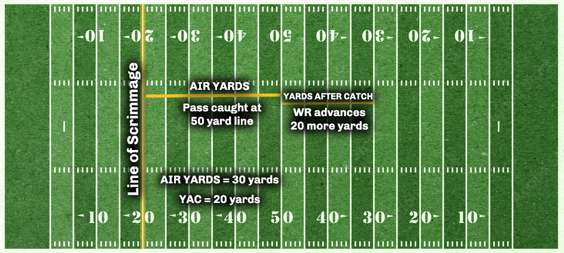

# Appendix {.unnumbered}


## The NFL Analytics Dictionary {.unnumbered}

### Air Yards {.unnumbered}

Air yards is the measure that the ball travels through the air, from the line of scrimmage, to the exact point where the wide receivers catches, or does not catch, the football. It does not take into consideration the amount of yardage gained after the catch by the wide receiver (which would be *yards after catch*).

For an example, please see the below illustration. In it, the line of scrimmag is at the 20-yardline. The QB completes a pass that is caught at midfield (the 50-yardline). After catching the football, the wide receiver is able to advance the ball down to the opposing 30-yardline before getting tackled. First and foremost, the quarterback is credited with a total of 50 passing yards on the play, while the wide receiver is credited with the same.

However, because air yards is a better metric to explore a QB's *true* impact on a play, he is credited with 30 air yards while the wide receiver is credited with 20 yards after catch.

In the end, quarterbacks with higher air yards per attempt are generally assumed to be throwing the ball deeper downfield than QBs with lower air yards per attempt.

<center>



</center>

There are multiple ways to collect data pertaining to air yards. However, the most straightforward way is to use `load_player_stats`:


```r
data <- nflreadr::load_player_stats(2021)

air.yards <- data %>%
  filter(season_type == "REG") %>%
  group_by(player_id) %>%
  summarize(
    attempts = sum(attempts),
    name = first(player_name),
    air.yards = sum(passing_air_yards),
    avg.ay = mean(passing_air_yards)) %>%
  filter(attempts >= 100) %>%
  select(name, air.yards, avg.ay) %>%
  arrange(-air.yards)

tibble(air.yards)
```

```
## # A tibble: 42 x 3
##    name       air.yards avg.ay
##    <chr>          <dbl>  <dbl>
##  1 T.Brady         5821   342.
##  2 J.Allen         5295   311.
##  3 M.Stafford      5094   300.
##  4 D.Carr          5084   299.
##  5 J.Herbert       5069   298.
##  6 P.Mahomes       4825   284.
##  7 T.Lawrence      4732   278.
##  8 D.Prescott      4612   288.
##  9 K.Cousins       4575   286.
## 10 J.Burrow        4225   264.
## # ... with 32 more rows
```

In the above example, we can see that Tom Brady led the NFL during the 2021 regular season with a comined total of 5,821 air yards which works out to an average of 342 air yards per game.

### Average Depth of Target {.unnumbered}

As mentioned above, a QB's air yards per attempt can highlight whether or not he is attempting to push the ball deeper down field than his counterparts. The official name of this is **Average Depth of Target** (or ADOT). We can easily generate this statistic using the `load_player_stats` function within `nflreader`:


```r
data <- nflreadr::load_player_stats(2021)

adot <- data %>%
  filter(season_type == "REG") %>%
  group_by(player_id) %>%
  summarize(
    name = first(player_name),
    attempts = sum(attempts),
    air.yards = sum(passing_air_yards),
    adot = air.yards / attempts) %>%
  filter(attempts >= 100) %>%
  arrange(-adot)

tibble(adot)
```

```
## # A tibble: 42 x 5
##    player_id  name       attempts air.yards  adot
##    <chr>      <chr>         <int>     <dbl> <dbl>
##  1 00-0035704 D.Lock          111      1117 10.1 
##  2 00-0029263 R.Wilson        400      3955  9.89
##  3 00-0036945 J.Fields        270      2636  9.76
##  4 00-0034796 L.Jackson       382      3531  9.24
##  5 00-0036389 J.Hurts         432      3882  8.99
##  6 00-0034855 B.Mayfield      418      3651  8.73
##  7 00-0026498 M.Stafford      601      5094  8.48
##  8 00-0031503 J.Winston       161      1340  8.32
##  9 00-0034857 J.Allen         646      5295  8.20
## 10 00-0029604 K.Cousins       561      4575  8.16
## # ... with 32 more rows
```

As seen in the results, if we ignore Drew Lock's 10.1 ADOT on just 111 attempts during the 2021 regular season, Russell Wilson attempted to push the ball, on average, furtherst downfield among QBs with atleast 100 attempts.
